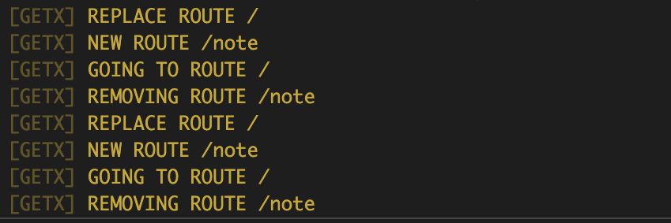

# Getx를 이용한 route

* Package 가져오기

main.dart, routes.dart, pages/home.dart, pages/note.dart에 모두 패키지를 추가합니다.

```dart
import 'package:get/get.dart';
```

이전 예제에서 이름있는 라우트 탐색을 통해 routing을 구현하였기에 동일한 방식을 따릅니다.

main.dart에서 MaterialApp을 GetMaterialApp으로 수정합니다.

```dart
class MyApp extends StatelessWidget {
  const MyApp({super.key});

  // This widget is the root of your application.
  @override
  Widget build(BuildContext context) {
    return GetMaterialApp(  /* 수정 */
      title: 'Flutter Demo',
      theme: ThemeData(
        // This is the theme of your application.
        //
        // Try running your application with "flutter run". You'll see the
        // application has a blue toolbar. Then, without quitting the app, try
        // changing the primarySwatch below to Colors.green and then invoke
        // "hot reload" (press "r" in the console where you ran "flutter run",
        // or simply save your changes to "hot reload" in a Flutter IDE).
        // Notice that the counter didn't reset back to zero; the application
        // is not restarted.
        primarySwatch: Colors.blue,
      ),
      initialRoute: '/',  /* 수정 */
      getPages: routes  /* 수정 */
    );
  }
}
```

routes.dart를 수정합니다.

```dart
final routes = [
  GetPage(name: '/', page: () => HomePage()),
  GetPage(name: '/note', page: () => NotePage())
];
```

이제 Get을 이용하여 namedRouting을 해봅시다.

pages/home.dart의 15번째 줄 onPressed 쪽

```dart
Get.offNamed('/note');
```

pages/note.dart의 15번째 줄 onPressed 쪽

```dart
Get.offAllNamed('/');
```

Get의 탐색 Case는 크게 3가지로 분류됩니다.

1. nextScreen으로 이동 (Navigator.pushNamed와 유사)

```dart
Get.toNamed("/NextScreen");
```

2. 다음으로 이동하면서 트리에서 이전 화면을 지웁니다. (Navigator.popAndPushNamed와 유사)

```dart
Get.offNamed("/NextScreen");
```

3. 다음으로 이동하고 트리에서 이전 화면 전체를 지웁니다. (Navigator.pushNamedAndRemoveUntil와 유사)

```dart
Get.offAllNamed("/NextScreen");
```

아래와 같은 로그가 디버그 콘솔에 나타나면 됩니다.



* **[참조]**

[https://github.com/jonataslaw/getx/blob/master/documentation/kr_KO/route_management.md#%EB%9D%BC%EC%9A%B0%ED%8A%B8-%EA%B4%80%EB%A6%AC](https://github.com/jonataslaw/getx/blob/master/documentation/kr_KO/route_management.md#%EB%9D%BC%EC%9A%B0%ED%8A%B8-%EA%B4%80%EB%A6%AC)
