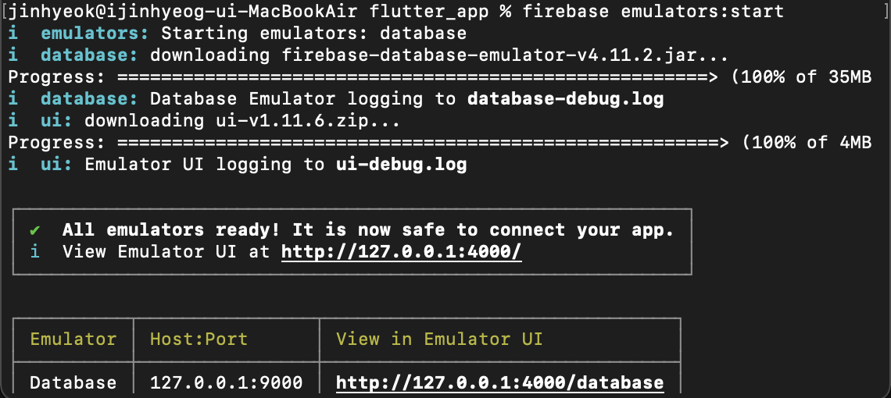
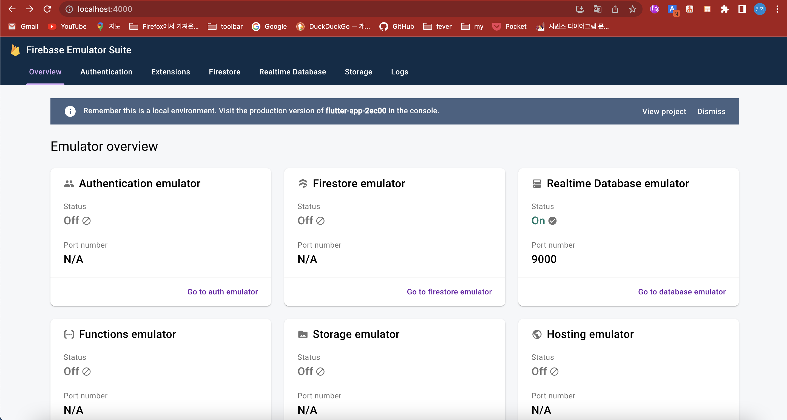
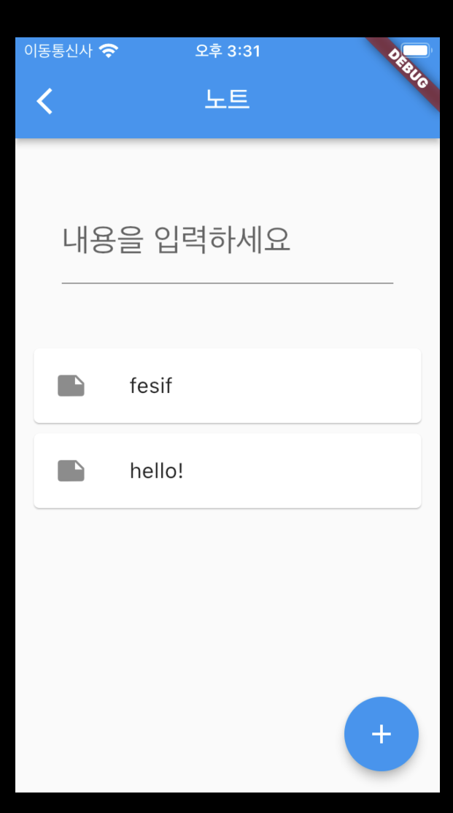
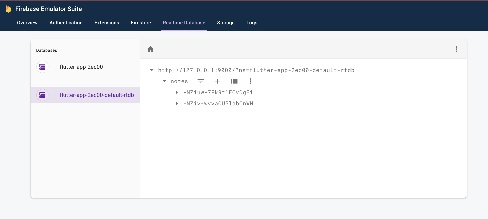

# Firebase, GetX를 활용하여 간단한 노트 앱 만들기

Firebase를 local에서 test하기 위해서 Emulator Suite를 사용합니다.

우선 Firebase 콘솔에서 project를 생성합니다.

구글 애널리틱스는 사용 안함으로 체크해 주세요.

[Flutter 앱에서 Firebase를 연동](./Flutter%20%EC%95%B1%EC%97%90%20Firebase%20%EC%B6%94%EA%B0%80.md)합니다.

Firebase 패키지를 추가합니다.

```console
flutter pub add firebase_database
```

```console
flutter pub add firebase_core
```

main.dart에 다음의 패키지를 import 합니다.

```dart
import 'package:flutter/foundation.dart';

import 'package:firebase_core/firebase_core.dart';
import 'package:firebase_database/firebase_database.dart';

import 'package:flutter_app/firebase_options.dart';
```

이후 main() 함수를 수정합니다.

```dart
void main() async {
  WidgetsFlutterBinding.ensureInitialized();
  await Firebase.initializeApp(
    options: DefaultFirebaseOptions.currentPlatform,
  );

  if (kDebugMode) {
    try {
      FirebaseDatabase.instance.useDatabaseEmulator('localhost', 9000);
    } catch (e) {
      // ignore: avoid_print
      print(e);
    }
  }
  runApp(const MyApp());
}
```

터미널에서 다음을 입력합니다.

```console
firebase emulators:start
```



브라우저에서 localhost:4000으로 접속합니다.



Go to database Emulator를 클릭, 로컬에서 반영된 데이터들을 확인할 수 있습니다.

다음으로 MVC 패턴을 적용하여 노트 앱을 만들어 봅시다.

model을 추가하기 위해 models/note.dart를 만들고 다음 코드를 입력합니다.

models/note.dart

```dart
import 'package:flutter_app/exceptions.dart';

class NoteField {
  static const String id = 'id';
  static const String content = 'content';
  static const String createdOn = 'created_on';
}

class Note {
  final String? id;
  final String content;
  final String? createdOn;

  Note({
    this.id,
    required this.content,
    this.createdOn
  }){
    initValidate();
  }

  void initValidate() {
    if (content.isEmpty) {
      throw ValidationError(cause: "Content shouldn't be empty");
    }
  }
}
```

inputController를 통해 받은 입력 데이터 값을 controller에 인자로 전달하기 위해 form 객체를 만듭니다.

```dart
class NoteForm {
  final String content;

  NoteForm({required this.content});
}
```

controller를 추가하기 위해 controllers/note.dart를 만들고

controllers/note.dart

```dart
import 'dart:async';

import 'package:get/get.dart';
import 'package:firebase_database/firebase_database.dart';

import 'package:flutter_app/models/note.dart';
import 'package:flutter_app/forms/note.dart';
import 'package:flutter_app/exceptions.dart';

/// CRUD: create, retrieve, update, delete
class NoteController extends GetxController {
  final notesRef = FirebaseDatabase.instance.ref().child('notes');
  RxList<Note> items = <Note>[].obs;

  @override
  void onInit() {
    super.onInit();
    _fetchData();
  }

  Future<List<Note>> _fetchData() async {
    final snapshot = await notesRef.get();

    if (snapshot.exists) {
      items.value = (snapshot.value as Map).entries.map((e) => Note(
        id: e.key,
        content: (e.value as Map)[NoteField.content],
        createdOn: (e.value as Map)[NoteField.createdOn]
      )).toList();
    }

    return items;
  }

  Future<Note> retrieve(String key) async {
    final snapshot = await notesRef.child(key).get();
    if (snapshot.exists) {
      return Note(
        id: snapshot.key,
        content: (snapshot.value as Map)[NoteField.content],
        createdOn: (snapshot.value as Map)[NoteField.createdOn]
      );
    }
    throw NotFoundError();
  }

  void create(NoteForm form) async {
    Note note = Note(content: form.content);
    DatabaseReference ref = notesRef.push();
    ref.set({
      NoteField.id: ref.key,
      NoteField.content: note.content,
      NoteField.createdOn: DateTime.now().toString()
    });
    items.add(note);
  }

  void delete(String key) async {
    await notesRef.child(key).remove();
    items.removeWhere((e) => e.id == key);
  }
}
```

위의 코드를 입력합니다.

이전에 pages였던 directory 명을 views로 수정합니다.

그리고 views/note.dart에서

```dart
import 'package:flutter/material.dart';
import 'package:get/get.dart';

import 'package:flutter_app/controllers/note.dart';
import 'package:flutter_app/forms/note.dart';

class NotePage extends StatelessWidget {
  NotePage({super.key});
  final inputController = TextEditingController();

  @override
  Widget build(BuildContext context) {
    Get.put(NoteController());

    return GetX<NoteController>(
        builder: (noteController) => Scaffold(
        appBar: AppBar(
          title: const Text('노트'),
        ),
        body: Center(
          child: Column(
            mainAxisAlignment: MainAxisAlignment.center,
            children: <Widget>[
              Container(
                padding: const EdgeInsets.all(15.0),
                child: Padding(
                  padding: const EdgeInsets.all(20.0),
                  child: TextField(
                    style: const TextStyle(
                      fontSize: 24.0, height: 2.0, color: Colors.black
                    ),
                    decoration: const InputDecoration(
                      hintText: '내용을 입력하세요'
                    ),
                    controller: inputController,
                  ),
                ),
              ),
              Expanded(
                child: SizedBox(
                  height: 200.0,
                  child: ListView.builder(
                    itemCount: noteController.items.length,
                    padding: const EdgeInsets.all(10.0),
                    itemBuilder: (context, position) {
                      return Card(
                        child: ListTile(
                          leading: const Icon(Icons.note),
                          title: Text(noteController.items[position].content),
                          onLongPress: () {
                            noteController.delete(noteController.items[position].id!);
                          },
                        )
                      );
                    },
                  ),
                ),
              ),
            ],
          ),
        ),
        floatingActionButton: FloatingActionButton(
          onPressed: () {
            noteController.create(NoteForm(content: inputController.text));
            inputController.clear();
          },
          tooltip: 'Add Note',
          child: const Icon(Icons.add),
        ),
      ),
    );
  }
}
```

이렇게 코드를 수정합니다.

\*\*\*\*![주의]\*\*\*\*

views/home.dart에서 아래와 같이 offNamed로 route해주어야 data를 onInit을 통해 불러옵니다.
만일 toNamed로 route 될 경우, 초기화 시에 데이터를 불러올 수 있도록 생성자 내부에 fetch 로직을 구현하면 됩니다. (다른 방식은 아직 잘 모르겠음.)

```dart
/// 코드
/// 이전 코드:
/// Get.toNamed('/note');
Get.offNamed('/note');
/// 코드
```

* 노트 페이지



* database



* **참조**

[https://firebase.google.com/codelabs/get-started-firebase-emulators-and-flutter?hl=ko#0](https://firebase.google.com/codelabs/get-started-firebase-emulators-and-flutter?hl=ko#0)

[https://danawalab.github.io/flutter/2022/08/05/Flutter-Getx.html](https://danawalab.github.io/flutter/2022/08/05/Flutter-Getx.html)

[https://github.com/nisrulz/flutter-examples/blob/develop/using_firebase_db/lib/main.dart](https://github.com/nisrulz/flutter-examples/blob/develop/using_firebase_db/lib/main.dart)
