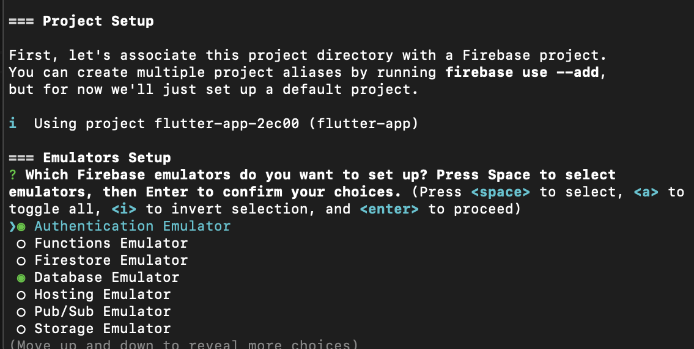
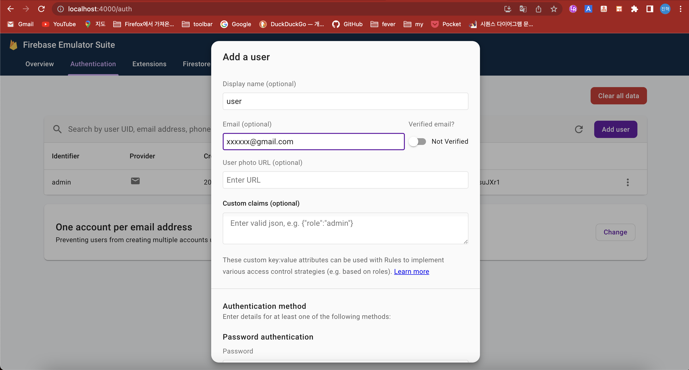

# Firebase Auth 연동하기

## Emulator 추가

아래와 같이 명령어를 입력합니다.

```console
firebase init emulators
```

authentication을 추가해줍니다.



main.dart에 Emulator를 등록합니다.

```dart
// import
import 'package:firebase_auth/firebase_auth.dart';

// main함수
      // FirebaseDatabase.instance.useDatabaseEmulator('localhost', 9000);
      await FirebaseAuth.instance.useAuthEmulator('localhost', 9099);
// ...
```

FirebaseAuth의 token 상태에 대한 Stream을 주입받기 위해 Provider를 사용합니다.

```console
flutter pub add provider
```

```dart
// import
import 'package:provider/provider.dart';
```

main.dart에 아래와 같이 코드를 입력합니다.

```dart
/// class MyApp
class MyApp extends StatelessWidget {
  const MyApp({super.key});

  // This widget is the root of your application.
  @override
  Widget build(BuildContext context) {
    return MultiProvider(
      providers: [],
      child: GetMaterialApp(
        title: 'Flutter Demo',
        theme: ThemeData(
          // This is the theme of your application.
          //
          // Try running your application with "flutter run". You'll see the
          // application has a blue toolbar. Then, without quitting the app, try
          // changing the primarySwatch below to Colors.green and then invoke
          // "hot reload" (press "r" in the console where you ran "flutter run",
          // or simply save your changes to "hot reload" in a Flutter IDE).
          // Notice that the counter didn't reset back to zero; the application
          // is not restarted.
          primarySwatch: Colors.blue,
        ),
        initialRoute: '/splash',
        getPages: routes
      ),
    );
  }
}
```

MultiProvider의 providers 인자 내에 Provider를 등록해주어야 합니다.
등록할 Provider는 AuthService에서 관리합니다.

services 폴더를 만들고 services/auth.dart에서 아래의 코드를 입력해주세요.

```dart
import 'package:firebase_auth/firebase_auth.dart';

class AuthService {
  final FirebaseAuth _firebaseAuth;

  AuthService(this._firebaseAuth);

  Stream<User?> get authStateChanges => _firebaseAuth.idTokenChanges();

  Future<void> signOut() async {
    await _firebaseAuth.signOut();
  }

  Future<int> signIn({required String email, required String password}) async {
    try {
      await _firebaseAuth.signInWithEmailAndPassword(email: email, password: password);
      return 1;
    } on FirebaseAuthException catch (e) {
      // ignore: avoid_print
      print(e.message);
      return 0;
    }
  }

  Future<int> signUp({required String email, required String password}) async {
    try {
      await _firebaseAuth.createUserWithEmailAndPassword(email: email, password: password);
      return 1;
    } on FirebaseAuthException catch (e) {
      // ignore: avoid_print
      print(e.message);
      return 0;
    }
  }
}
```

main.dart에서 provider를 등록합니다.

```dart
/// import
import 'package:flutter_app/service/auth.dart';

/// ...
      providers: [
        Provider<AuthService>(
          create: (_) => AuthService(FirebaseAuth.instance),
        ),
        StreamProvider(
          initialData: null,
          create: (context) => context.read<AuthService>().authStateChanges,
        ),
      ],
/// ...
```

이제 초기 화면을 splash 화면으로 바꾸고, 로그인 여부에 따라 signin page 혹은 home page로 route 합니다.

views/signin.dart

```dart
import 'package:provider/provider.dart';
import 'package:flutter/material.dart';

import 'package:flutter_app/services/auth.dart';

class SigninPage extends StatelessWidget {
  SigninPage({super.key});

  final TextEditingController emailController = TextEditingController();
  final TextEditingController passwordController = TextEditingController();

  @override
  Widget build(BuildContext context) {
    return Scaffold(
      body: Column(
        children: [
          TextField(
            controller: emailController,
            decoration: const InputDecoration(
              labelText: "Email",
            ),
          ),
          TextField(
            controller: passwordController,
            decoration: const InputDecoration(
              labelText: "Password"
            ),
          ),
          ElevatedButton(
            onPressed: () {
              context.read<AuthService>().signIn(
                email: emailController.text.trim(),
                password: passwordController.text.trim(),
              );
            },
            child: const Text("Sign in"),
          ),
        ],
      ),
    );
  }
}
```

views/splash.dart

```dart
import 'package:firebase_auth/firebase_auth.dart';
import 'package:flutter/material.dart';
import 'package:provider/provider.dart';

import 'package:flutter_app/views/home.dart';
import 'package:flutter_app/views/signin.dart';

class SplashPage extends StatelessWidget {
  const SplashPage({super.key});

  @override
  Widget build(BuildContext context) {
    final firebaseUser = context.watch<User?>();

    if (firebaseUser != null) {
      return const HomePage();
    }
    return SigninPage();
  }
}
```

views/routes.dart

```dart
import 'package:get/get.dart';

import 'package:flutter_app/views/home.dart';
import 'package:flutter_app/views/note.dart';
import 'package:flutter_app/views/splash.dart';

final routes = [
  GetPage(name: '/', page: () => const HomePage()),
  GetPage(name: '/note', page: () => NotePage()),
  GetPage(name: '/splash', page: () => const SplashPage()),
];
```

\*\*\*\*![주의]\*\*\*\*

Firebase emulator (localhost:4000) 에서 Authentication 쪽에 유저를 등록해주어야 정상적으로 로그인 기능이 동작합니다.



* **참조**

[https://firebase.google.com/docs/auth/flutter/start?hl=ko](https://firebase.google.com/docs/auth/flutter/start?hl=ko)
[https://github.com/RobertBrunhage/flutter_firebase_auth_tutorial/tree/master](https://github.com/RobertBrunhage/flutter_firebase_auth_tutorial/tree/master)
